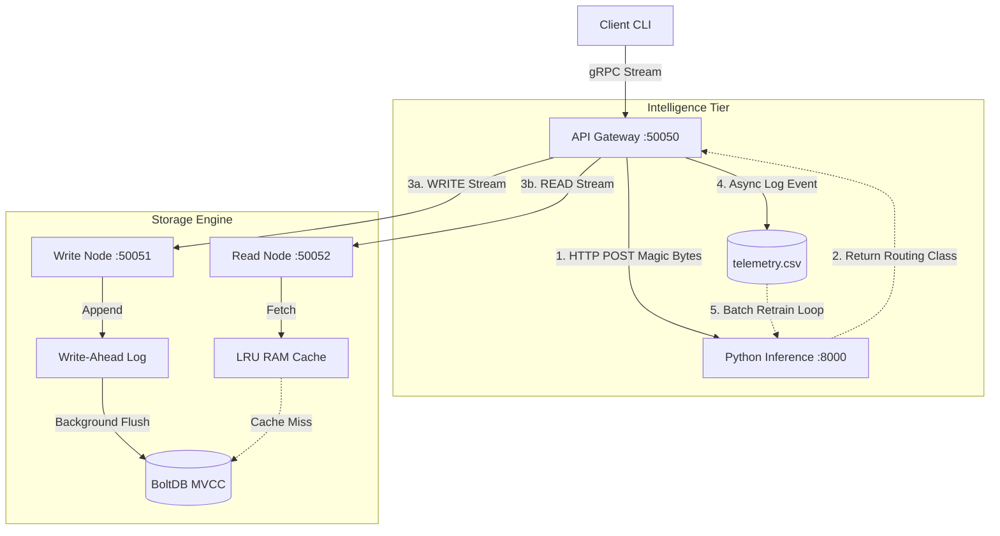
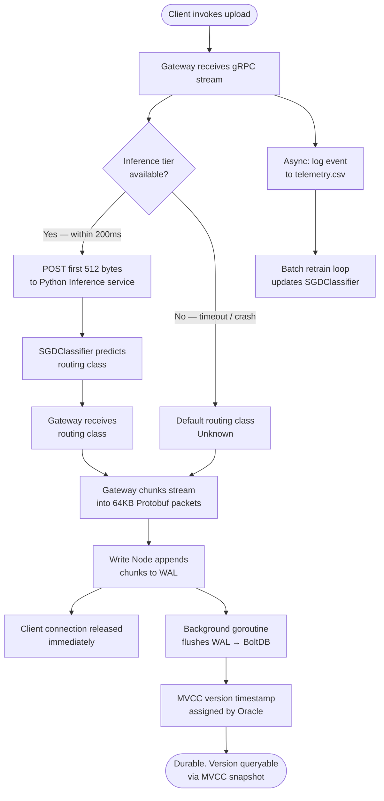

# Heimdall

> A distributed, low-latency storage engine with heuristic-based routing, built in Go.

Heimdall implements an append-only Write-Ahead Log (WAL) for high-throughput ingestion, Multi-Version Concurrency Control (MVCC) for non-blocking reads, and a gRPC-based streaming gateway. It features crash recovery via WAL replay, a live Prometheus metrics endpoint, and an experimental Python inference tier that routes data based on structural file heuristics to optimise caching strategies.

**Core Stack:** Go · Python · gRPC · Protobuf · BoltDB · FastAPI · scikit-learn · Prometheus

---

## Table of Contents

- [Heimdall](#heimdall)
  - [Table of Contents](#table-of-contents)
  - [System Architecture](#system-architecture)
  - [Request Lifecycle](#request-lifecycle)
  - [Core Components](#core-components)
    - [API Gateway `cmd/gateway`](#api-gateway-cmdgateway)
    - [Write Engine `cmd/writenode`](#write-engine-cmdwritenode)
    - [Read Engine `cmd/readnode`](#read-engine-cmdreadnode)
    - [Timestamp Oracle `core/`](#timestamp-oracle-core)
    - [Inference Tier `ml_service/`](#inference-tier-ml_service)
  - [Design Decisions](#design-decisions)
  - [CLI Reference](#cli-reference)
    - [`upload`](#upload)
    - [`download`](#download)
    - [`list`](#list)
  - [Getting Started](#getting-started)
    - [Prerequisites](#prerequisites)
    - [1. Go dependencies](#1-go-dependencies)
    - [2. Python environment](#2-python-environment)
    - [3. Boot the cluster](#3-boot-the-cluster)
    - [4. Run the test suite](#4-run-the-test-suite)
  - [Benchmarks](#benchmarks)
    - [WAL asynchronous ingestion speedup](#wal-asynchronous-ingestion-speedup)
  - [Failure Modes](#failure-modes)
  - [Known Limitations \& Future Work](#known-limitations--future-work)
  - [Repository Structure](#repository-structure)

---

## System Architecture



---

## Request Lifecycle

The diagram below traces the full path of a write request through the cluster, from client invocation to durable storage.



---

## Core Components

### API Gateway `cmd/gateway`
The central entry point for all client traffic. Implements Protobuf `oneof` streaming to transmit raw binary payloads in 64KB chunks without buffering the full file in memory, preventing OOM crashes on large files. Enforces a 200ms timeout on the inference tier; failures fall back to a default routing class without interrupting the gRPC stream. Exposes a live `/metrics` endpoint on port `2112` via `prometheus/client_golang`, tracking total bytes ingested, read/write volumes, and a latency histogram for ML inference calls.

### Write Engine `cmd/writenode`
Accepts chunked streams from the Gateway and appends them sequentially to an append-only WAL encoded in a strict binary format (Timestamp · Lengths · Payload). The client connection is released immediately upon WAL acknowledgement. A background goroutine asynchronously flushes completed entries to the BoltDB metadata store, decoupling network ingestion from disk I/O latency. On startup, `ReplayWAL()` scans the binary log for any uncommitted transactions from a previous crash and replays them into BoltDB before accepting new writes, guaranteeing durability across restarts.

### Read Engine `cmd/readnode`
Serves point-in-time reads using MVCC snapshot isolation. Hot data is served directly from a memory-bounded LRU cache. On a cache miss, historical chunk recipes are fetched from BoltDB and the assembled byte stream is returned to the Gateway.

### Timestamp Oracle `core/`
A `sync.Mutex`-protected counter that issues monotonically increasing transaction IDs. Provides the version timestamps underpinning MVCC snapshot isolation. Verified under 1000 concurrent goroutines in the unit test suite.

### Inference Tier `ml_service/`
An experimental FastAPI microservice. Accepts the first 512 bytes of each incoming stream and encodes them into a fixed-length feature vector via `HashingVectorizer`. An `SGDClassifier` predicts whether the file structure correlates with read-heavy or write-heavy telemetry patterns, informing downstream caching strategy. The model retrains asynchronously as new telemetry accumulates.

> **Note:** The inference tier is a proof-of-concept for online-learning telemetry loops. Model accuracy has not yet been formally evaluated against a real-world file sample set. It is not on the critical path — a timeout or crash degrades gracefully to default routing.

---

## Design Decisions

**gRPC over REST**
Protobuf's binary serialisation is significantly more efficient than JSON for raw byte payloads. More critically, gRPC's native bidirectional streaming is required for chunked file transmission — REST would require buffering the entire file before transmission.

**BoltDB for metadata**
BoltDB provides a B+Tree structure with full ACID transaction guarantees. The trade-off is an exclusive write lock, which created a severe ingestion bottleneck under concurrent load. This bottleneck directly motivated the WAL: by decoupling the network ingestion path from the BoltDB write lock, the Write Node can absorb bursts of concurrent writes and flush to BoltDB sequentially in the background.

The schema uses a single `FileMeta` bucket keyed by filename, with each value being a JSON-serialised `FileHistory` struct containing the full version array. This keeps all version history for a file co-located under one key, avoiding cross-key joins on reads. The `GetAllFiles` traversal is written to be fault-tolerant — malformed or legacy rows (e.g. from schema migrations) are logged and skipped rather than crashing the query.

**Python for the inference tier**
scikit-learn's SGDClassifier and the `partial_fit` API for incremental learning have no mature equivalent in the Go ecosystem. The trade-off is a network hop on the hot path (HTTP over localhost). This is mitigated by the 200ms timeout and graceful fallback, ensuring the ML tier cannot become a bottleneck or single point of failure for storage operations.

**Prometheus for observability**
Rather than parsing stdout logs to understand system behaviour, the Gateway exposes a `/metrics` endpoint on port `2112`. This allows Prometheus to scrape live counters and histograms, and crucially makes the 200ms ML timeout circuit-breaker verifiable — the inference latency histogram shows exactly where requests are falling on the distribution, not just whether the fallback fired.

---

## CLI Reference

All commands are issued via the client CLI. Boot the full cluster first (see [Getting Started](#getting-started)).

```
go run cmd/client/main.go <command> [arguments]
```

### `upload`

Uploads a file to the cluster. The Gateway extracts magic bytes, consults the inference tier, routes the stream to the Write Node, and returns a version timestamp on success.

```bash
go run cmd/client/main.go upload <filepath>
```

| Argument | Description |
|---|---|
| `filepath` | Path to the local file to upload |

**Example**

```bash
go run cmd/client/main.go upload ./data/my_dataset.csv

# ✅ Success! File ingested. Version Timestamp: 1
```

The returned version timestamp is required for all subsequent `download` calls targeting this exact version of the file.

---

### `download`

Downloads a historical snapshot of a file at a specific MVCC version timestamp. Reconstructs the exact byte sequence that existed at that version, regardless of later writes to the same filename.

```bash
go run cmd/client/main.go download <filename> <version> <output_filepath>
```

| Argument | Description |
|---|---|
| `filename` | The original name of the uploaded file |
| `version` | The version timestamp returned at upload time |
| `output_filepath` | Destination path for the reconstructed file |

**Example**

```bash
go run cmd/client/main.go download my_dataset.csv 1 ./restored/my_dataset_v1.csv

# ✅ Success! Downloaded 45032 bytes → ./restored/my_dataset_v1.csv
```

**Time-travel reads:** Because Heimdall uses MVCC, you can upload the same filename multiple times and download any prior version independently. Version timestamps are monotonically increasing and stable — version `1` of a file will always resolve to the same bytes.

---

### `list`

Queries the `FileMeta` BoltDB bucket and prints every tracked filename alongside its full MVCC version history. Provides direct, human-readable proof that the system is correctly recording and persisting version timestamps.

```bash
go run cmd/client/main.go list
```

No arguments required.

**Example**

```bash
go run cmd/client/main.go list

# Files stored in Heimdall:
# ─────────────────────────────────────────
#  my_dataset.csv      versions: [1, 2, 3]
#  report.pdf          versions: [1]
#  config.json         versions: [1, 2]
# ─────────────────────────────────────────
# Total: 3 file(s)
```

**Schema resilience:** The `GetAllFiles` traversal is fault-tolerant. If a row in BoltDB contains malformed data or was written by a prior schema version, the anomaly is logged and the row is skipped rather than returning a fatal error. The remainder of the file list renders correctly.

---

## Getting Started

### Prerequisites

- Go `v1.20+`
- Python `v3.9+`

### 1. Go dependencies

```bash
go mod tidy
```

### 2. Python environment

```bash
cd ml_service
python -m venv venv

# macOS / Linux
source venv/bin/activate

# Windows
.\venv\Scripts\Activate

pip install -r requirements.txt
python train.py        # Generates the initial baseline model weights
```

### 3. Boot the cluster

Launch each microservice in a separate terminal, in this order:

```bash
# Terminal 1 — Inference tier
cd ml_service && python main.py

# Terminal 2 — API Gateway
go run ./cmd/gateway

# Terminal 3 — Write Node
go run cmd/writenode/main.go

# Terminal 4 — Read Node
go run cmd/readnode/main.go
```

### 4. Run the test suite

```bash
# Unit tests — Oracle monotonicity, LRU eviction, WAL crash recovery
go test ./core/...

# End-to-end integration test — byte-for-byte upload/download correctness
go run test_cluster.go
```

`TestWALRecovery` simulates a dirty crash by writing entries to the WAL, terminating before the BoltDB flush, and verifying that `ReplayWAL()` on reboot recovers all data correctly.

---

## Benchmarks

> Benchmarks executed locally: Windows 11, NVMe SSD, 16GB RAM.

### WAL asynchronous ingestion speedup

**Methodology:** 100 concurrent uploads of a 4KB file payload.

| Mode | Ingestion time | Notes |
|---|---|---|
| Synchronous baseline | ~323ms | Hash + BoltDB B+Tree traversal + disk write per file |
| Heimdall WAL (async) | ~1.2ms | Sequential append to `heimdall.wal` |
| **Speedup** | **~270×** | |

The speedup reflects the mechanical advantage of sequential I/O over random disk I/O. Real-world distributed deployments will see a smaller multiplier due to network latency between nodes.

---

## Failure Modes

| Scenario | Behaviour |
|---|---|
| **Inference service crash or timeout** | Gateway falls back to `Unknown` routing class. gRPC stream continues uninterrupted. |
| **Gateway crash** | All cluster traffic halts. The Gateway is currently a single instance with no failover. |
| **Write Node crash before WAL flush** | WAL data is retained on disk in binary format. `ReplayWAL()` automatically replays uncommitted transactions into BoltDB on the next startup. Verified by `TestWALRecovery`. |

---

## Known Limitations & Future Work

**ML validation gate**
The continuous learning loop retrains on incoming telemetry without a held-out validation set, and model accuracy has not been formally measured against real file samples. A degraded telemetry batch can silently reduce routing quality with no observable signal. Future iterations should introduce a labelled evaluation set of real file types and enforce an accuracy threshold check before hot-swapping model weights.

**Cluster consensus**
Nodes are addressed via hardcoded localhost ports. Production deployment requires service discovery (e.g., Consul) and a consensus protocol (e.g., Raft) for leader election and node health management.

**Observability**
The cluster exposes Prometheus metrics but currently lacks structured JSON logging for Grafana/Loki integration. Log lines are written to stdout in plain text.

**Network failure injection**
The integration test suite covers the happy-path upload/download cycle. Fault injection (e.g., mid-stream node crashes, network partitions) is a known gap.

---

## Repository Structure

```
├── cmd/
│   ├── client/       # CLI — upload, download, list commands
│   ├── gateway/      # API Gateway, telemetry logger, inference client, /metrics
│   ├── readnode/     # Read Engine, LRU cache
│   └── writenode/    # Write Engine, WAL, ReplayWAL
├── core/             # Shared: Vault, Timestamp Oracle, LRU Cache, WAL
├── ml_service/       # Python FastAPI inference server, retraining loop
├── proto/            # Protobuf definitions (heimdall.proto)
├── go.mod            # Go module dependencies
├── requirements.txt  # Pinned Python dependencies
├── test_cluster.go   # End-to-end integration test suite
└── ARCHITECTURE.md   # Byte-level WAL format, BoltDB schema, Protobuf contracts
```

---

<p align="center">
  Built by <a href="https://github.com/tyrobro">Shaurya Jain</a>
</p>