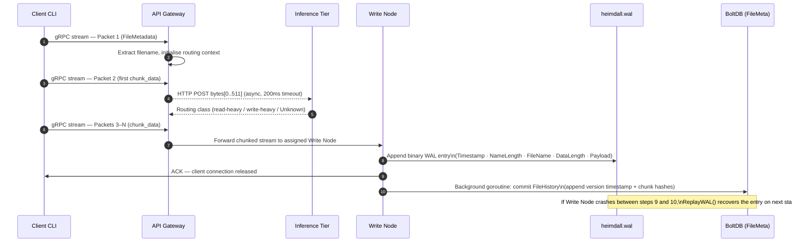

# Heimdall: Internal Architecture & Data Formats

This document details the byte-level storage formats, database schemas, and network contracts underpinning Heimdall's distributed MVCC engine. It is intended for contributors and reviewers who need to understand the system below the README level.

---

## Table of Contents

- [Heimdall: Internal Architecture \& Data Formats](#heimdall-internal-architecture--data-formats)
  - [Table of Contents](#table-of-contents)
  - [1. Write-Ahead Log Binary Format](#1-write-ahead-log-binary-format)
    - [Entry structure](#entry-structure)
    - [Replay invariant](#replay-invariant)
  - [2. BoltDB MVCC Schema](#2-boltdb-mvcc-schema)
    - [Bucket layout](#bucket-layout)
    - [`FileHistory` schema](#filehistory-schema)
    - [Read path](#read-path)
    - [Design note](#design-note)
  - [3. Protobuf Network Contracts](#3-protobuf-network-contracts)
    - [`WriteRequest` message](#writerequest-message)
    - [Packet sequence](#packet-sequence)
  - [4. Write Path: End-to-End](#4-write-path-end-to-end)

---

## 1. Write-Ahead Log Binary Format

To sustain high-throughput ingestion without contending on BoltDB's exclusive write lock, incoming gRPC streams are immediately serialised to `heimdall.wal` before any database interaction occurs.

The WAL is an append-only binary file. Entries are packed contiguously with no delimiters or padding, maximising sequential I/O throughput. On startup following an unclean shutdown, `ReplayWAL()` scans this byte structure to identify and recover any transactions that were appended to the WAL but never committed to BoltDB.

### Entry structure

Each WAL entry is a self-describing variable-length record. The length fields at fixed offsets allow the reader to correctly advance through the file without a separate index.

| Offset | Field | Size | Type | Description |
| :--- | :--- | :--- | :--- | :--- |
| `0x00` | `Timestamp` | 8 bytes | `int64` | Monotonically increasing MVCC transaction ID, issued by the Timestamp Oracle. |
| `0x08` | `NameLength` | 4 bytes | `int32` | Byte length of the filename string. |
| `0x0C` | `FileName` | `NameLength` bytes | `[]byte` | UTF-8 encoded filename. |
| `0x0C + NameLength` | `DataLength` | 4 bytes | `int32` | Byte length of the file payload. |
| `0x10 + NameLength` | `Payload` | `DataLength` bytes | `[]byte` | Raw binary file payload. |

### Replay invariant

`ReplayWAL()` reads each entry sequentially and checks whether the entry's `Timestamp` already exists as a key in the `FileMeta` BoltDB bucket. If the key is absent, the entry was not committed before the crash and is replayed. If the key is present, the entry is skipped as a duplicate. This makes replay **idempotent** — it is safe to run on a clean database or a partially recovered one.

---

## 2. BoltDB MVCC Schema

Heimdall uses BoltDB to persist the MVCC metadata index. The schema is designed to keep the complete version history of each file co-located under a single key, avoiding cross-key joins on reads.

### Bucket layout

All metadata is stored in a single top-level bucket named `FileMeta`.

| Element | Value |
| :--- | :--- |
| **Bucket** | `FileMeta` |
| **Key** | `[]byte(fileName)` — e.g. `report.csv` |
| **Value** | JSON-serialised `FileHistory` struct |

### `FileHistory` schema

```json
{
  "versions": [
    {
      "timestamp": 1,
      "hashes": ["hash_A1", "hash_B2"]
    },
    {
      "timestamp": 2,
      "hashes": ["hash_C3"]
    }
  ]
}
```

Each element of `versions` represents one MVCC snapshot. The `hashes` array enumerates the content-addressed chunk hashes that, when fetched and concatenated in order, reconstruct the file exactly as it existed at that `timestamp`.

### Read path

A point-in-time read resolves as follows:

1. Look up `[]byte(fileName)` in `FileMeta`.
2. Deserialise the `FileHistory` value.
3. Iterate `versions` to find the entry whose `timestamp` matches the requested version.
4. Fetch each hash in `hashes` from the chunk store, in order.
5. Stream the assembled bytes back to the Gateway.

The LRU cache sits in front of step 4 — a cache hit serves the chunk bytes directly from memory, bypassing the BoltDB and chunk store lookups entirely.

### Design note

Storing the full version history as a JSON array under a single key means that every write appends to this array and re-serialises the entire value. This is acceptable at current scale but becomes a bottleneck for files with very high write frequency. A future migration could store each version as a separate key using a composite key scheme of `fileName:timestamp`, enabling range scans over version history without deserialising the full array.

---

## 3. Protobuf Network Contracts

To prevent OOM crashes on large uploads, Heimdall never buffers an entire file in memory. Files are transmitted across the gRPC boundary as a stream of 64KB `chunk_data` packets, preceded by a single metadata packet.

### `WriteRequest` message

Protobuf's `oneof` field is used to express the two distinct packet roles within a single stream type, eliminating the need for a separate RPC for metadata.

```protobuf
message WriteRequest {
    oneof payload {
        FileMetadata metadata   = 1;  // Packet 1 only
        bytes        chunk_data = 2;  // Packets 2 through N
    }
}

message FileMetadata {
    string file_name = 1;
}
```

### Packet sequence

```
Packet 1     →  metadata    { file_name: "dataset.csv" }
Packet 2     →  chunk_data  [ first 64KB — magic bytes extracted from offset 0..511 ]
Packets 3-N  →  chunk_data  [ remaining payload, streamed directly to Write Node ]
```

| Packet | Content | Gateway action |
| :--- | :--- | :--- |
| 1 | `FileMetadata` | Extracts filename, initialises routing context. |
| 2 | First `chunk_data` | Peeks at bytes `0..511` (magic bytes), fires async HTTP POST to the inference tier to obtain a routing class. |
| 3–N | Subsequent `chunk_data` | Forwarded directly to the Write Node assigned by the routing decision. |

The inference HTTP POST runs concurrently with the forwarding of packet 2 — the Gateway does not stall the stream while awaiting a routing class. If the inference tier does not respond within 200ms, the Gateway proceeds with the `Unknown` default routing class and the stream is never interrupted.

---

## 4. Write Path: End-to-End

The following diagram traces a single upload through every layer described in this document, from the initial gRPC packet to a durable WAL entry and eventual BoltDB commit.



---

*For setup instructions and CLI usage, see [README.md](./README.md).*